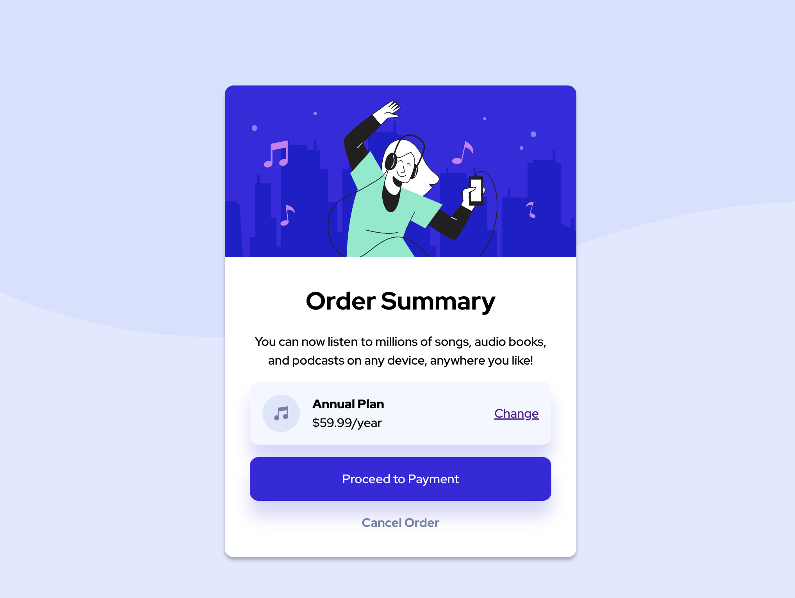

# Frontend Mentor - Order summary card solution

This is a solution to the [Order summary card challenge on Frontend Mentor](https://www.frontendmentor.io/challenges/order-summary-component-QlPmajDUj). Frontend Mentor challenges help you improve your coding skills by building realistic projects. 

## Table of contents

- [Overview](#overview)
  - [The challenge](#the-challenge)
  - [Screenshot](#screenshot)
  - [Links](#links)
- [My process](#my-process)
  - [Built with](#built-with)
  - [What I learned](#what-i-learned)
  - [Continued development](#continued-development)
  - [Useful resources](#useful-resources)
- [Author](#author)
- [Acknowledgments](#acknowledgments)

**Note: Delete this note and update the table of contents based on what sections you keep.**

## Overview

### The challenge

Users should be able to:

- See hover states for interactive elements

### Screenshot

### Links

- Solution URL: [Add solution URL here](https://your-solution-url.com)
- Live Site URL: [Add live site URL here](https://your-live-site-url.com)

## My process

### Built with

- Semantic HTML5 markup
- CSS custom properties
- Flexbox
- Figma
- Mobile-first workflow

### What I learned

Flex-grow is my friend!!!

### Continued development

Sizing the text so that it matches the copy, I need to add a media query since there is a slight font size difference bettween desktop and mobile, hence why the copy isnt laid out the same. Was going to do ``&nbsp;`` but decided to just focus on submitting something with a time constraint i set for myself. 

### Useful resources

(https://convertingcolors.com)
before i just decided to use rbga cause it was provided in the figma file. 
(https://stackoverflow.com/questions/3212459/is-there-a-command-to-undo-git-init)
there was an older repo that the file was connected to instead of making changes to it i wanted to scrap it all together. so to keep everything in order i just removed this folder from git and reinitialized it. 

## Author

- Frontend Mentor - [@MorganEJLA](https://www.frontendmentor.io/profile/@MorganEJLA)

## Acknowledgments

Part of the GDI 2023 Frontend Mentor Cohort! 